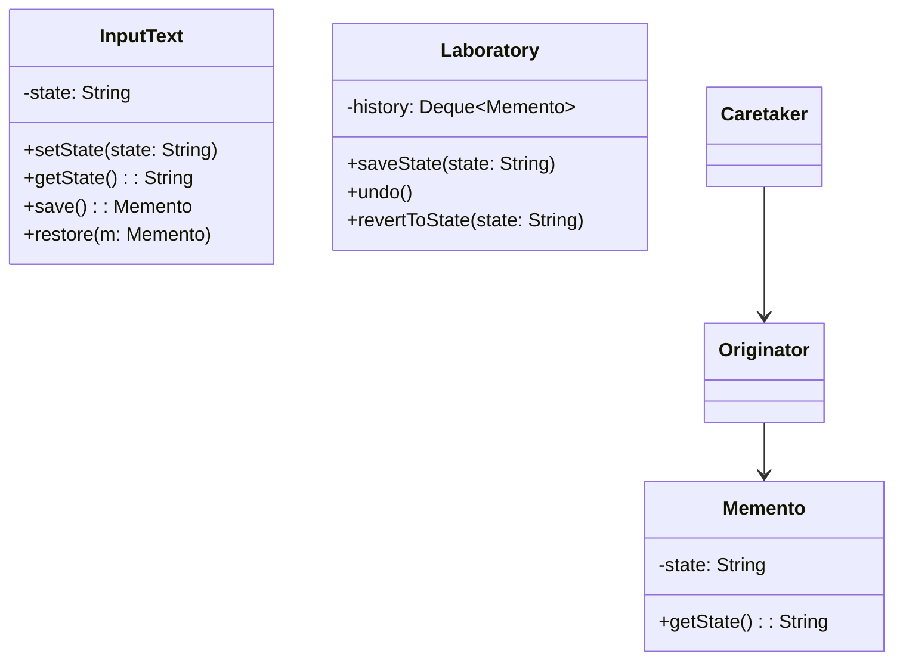

# Patrón Memento

## Definición
El **Patrón Memento** permite capturar y almacenar el estado interno de un objeto sin violar su encapsulación,  
de modo que el objeto pueda volver a ese estado más adelante.

Es muy útil para implementar funcionalidades como **deshacer (undo)**, **historial de cambios**, o **revertir configuraciones**.

## Diagrama

## Resultado obtenido
Al ejecutar el código de ejemplo, se observa que el objeto Laboratory puede guardar y restaurar
diferentes estados del objeto InputText (Originator) mediante snapshots (Memento),
permitiendo realizar operaciones como deshacer o revertir a un estado previo sin exponer los detalles internos.
```
10:18:47.350 [main] INFO org.patterns.Main -- Current state: State 5 
10:18:47.354 [main] INFO org.patterns.Main -- Current state: State 3 
10:18:47.354 [main] INFO org.patterns.Main -- Revert to: State 2
```
## Donde aplicarlo
| **Caso de Uso**                              | **Descripción / Ejemplo**                                                                                                         |
| --------------------------------------------- | --------------------------------------------------------------------------------------------------------------------------------- |
| **Editores de texto**                         | Permitir funciones de **Deshacer / Rehacer** almacenando el estado del documento tras cada cambio.                               |
| **Formularios o configuraciones**             | Guardar versiones previas de configuraciones antes de aplicar cambios.                                                           |
| **Juegos**                                    | Implementar puntos de control (**checkpoints**) para restaurar el progreso del jugador.                                           |
| **Aplicaciones gráficas**                     | Guardar el estado de la escena o de un lienzo para volver atrás si el usuario lo desea.                                           |
| **Procesos de negocio**                       | Revertir transacciones o pasos de un flujo complejo si ocurre un error.                                                          |
| **Sistemas con historial o auditoría**        | Mantener una pila de estados anteriores para poder volver a un punto anterior del tiempo.                                        |

## Ventajas
- Permite restaurar estados previos sin violar la encapsulación del objeto.
- Facilita la implementación de funcionalidades de deshacer.
- Separa la lógica de negocio del manejo de historial.
- Mejora la seguridad al mantener el estado encapsulado dentro del Memento.
- Puede usarse junto con el Patrón Command para crear sistemas de reversión potentes.

## Desventajas 
- Puede incrementar el consumo de memoria si se guardan muchos estados o grandes volúmenes de datos.
- Requiere gestionar cuidadosamente el historial (limpieza o límites) para evitar fugas de memoria.
- La implementación puede volverse compleja si el estado del objeto es muy grande o anidado.
- No ofrece un mecanismo estándar de serialización o persistencia de los mementos: debe manejarse manualmente.