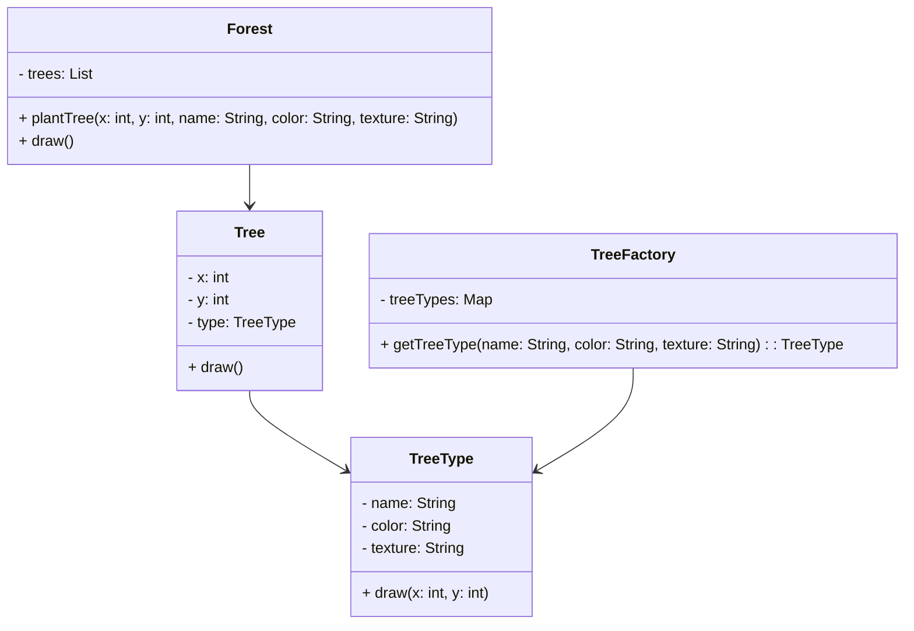

# Patrón Facade

## Definición
El patrón Flyweight tiene como objetivo minimizar el uso de memoria compartiendo objetos que tienen un estado común (intrínseco) entre múltiples instancias.
Permite crear una gran cantidad de objetos similares sin duplicar datos innecesarios, separando lo que es compartido de lo que es único por instancia.

---

## Diagrama

## Resultado obtenido
Al ejecutar la clase Main, se espera que se planten múltiples árboles, pero solo se creen instancias de TreeType para los tipos únicos de árboles.
Esto demuestra que el patrón Flyweight está funcionando correctamente al reutilizar los objetos compartidos.
```
23:23:46.158 [main] INFO org.patterns.buscomp.TreeFactory -- Creando nuevo TreeType: Roble-Verde-Áspera
23:23:46.165 [main] INFO org.patterns.buscomp.TreeFactory -- Creando nuevo TreeType: Pino-Verde Oscuro-Lisa
23:23:46.165 [main] INFO org.patterns.buscomp.TreeType -- Dibujando árbol de tipo Roble en (1,2) con color Verde y textura Áspera
23:23:46.165 [main] INFO org.patterns.buscomp.TreeType -- Dibujando árbol de tipo Roble en (3,4) con color Verde y textura Áspera
23:23:46.165 [main] INFO org.patterns.buscomp.TreeType -- Dibujando árbol de tipo Pino en (5,6) con color Verde Oscuro y textura Lisa
23:23:46.165 [main] INFO org.patterns.buscomp.TreeType -- Dibujando árbol de tipo Pino en (7,8) con color Verde Oscuro y textura Lisa
```
## Donde aplicarlo

| Caso de uso                               | Descripción                                                                              |
| ----------------------------------------- | ---------------------------------------------------------------------------------------- |
| Motores de videojuegos o gráficos         | Reutilizar modelos, texturas o sprites repetidos (como árboles, rocas o personajes).     |
| Aplicaciones de mapas                     | Compartir íconos o tipos de marcadores repetidos en grandes volúmenes de datos.          |
| Procesadores de texto                     | Compartir objetos `Character` que representan letras o símbolos idénticos.               |
| Sistemas de cache                         | Reutilizar objetos pesados o inmutables que se crean con frecuencia.                     |
| Aplicaciones con alta densidad de objetos | Escenarios donde se crean miles o millones de instancias similares, optimizando memoria. |

## Ventajas
- Reduce significativamente el uso de memoria, compartiendo datos comunes entre múltiples objetos.
- Mejora el rendimiento, al evitar la creación innecesaria de instancias repetidas.
- Facilita el manejo de grandes volúmenes de objetos con características similares.
- Separa claramente el estado intrínseco (compartido) del extrínseco (único por instancia).

## Desventajas 
- Aumenta la complejidad del código, ya que se deben distinguir los estados compartidos y no compartidos.
- Requiere coordinación externa para pasar el estado extrínseco al momento de usar el objeto.
- Si se abusa del patrón, puede hacer que el código sea más difícil de mantener o entender.
- El beneficio solo se nota en sistemas con gran cantidad de objetos similares.