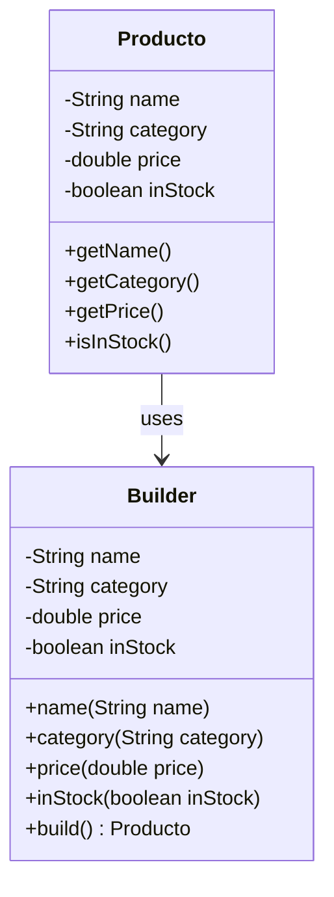

# Patrón Singleton

## Definición
El patrón Builder es un patrón de diseño creacional que separa la construcción de un objeto complejo de su representación, de manera que el mismo proceso de construcción puede crear diferentes representaciones del objeto.
En otras palabras, permite crear objetos paso a paso, configurando solo los atributos necesarios, sin necesidad de tener múltiples constructores con diferentes combinaciones de parámetros.

## Diagrama

## Resultado obtenido
```
Product{name='Apple', category='Fruit', price=0.99, inStock=true}
Product{name='Laptop', category='Electronics', price=1299.99, inStock=false}
```
## Donde aplicarlo
| **Caso de Uso**                        | **Descripción / Ejemplo**                                                                                                                                                    |
| -------------------------------------- | ---------------------------------------------------------------------------------------------------------------------------------------------------------------------------- |
| Objetos complejos con muchos atributos | Cuando una clase tiene muchos parámetros, algunos opcionales. Ej: Producto con nombre, precio, categoría, stock, descripción, fecha de caducidad.                            |
| Evitar el “Telescoping Constructor”    | Evita tener múltiples constructores para todas las combinaciones de parámetros. Builder permite configurar solo lo necesario y construir el objeto al final.                 |
| Objetos inmutables                     | Facilita la creación de objetos con campos `final` que no cambian después de ser creados.                                                                                    |
| Creación paso a paso                   | Útil cuando la construcción del objeto requiere varias etapas o validaciones. Ej: construir un informe con encabezado, cuerpo y pie de página.                               |
| Variantes del mismo objeto             | Permite crear diferentes representaciones del mismo objeto usando el mismo proceso de construcción. Ej: un carro con distintas configuraciones de motor, color y accesorios. |

## Ventajas
- Permite construir objetos complejos de manera clara y legible, utilizando encadenamiento de métodos (method chaining).
- Evita la necesidad de tener múltiples constructores con combinaciones de parámetros, solucionando el problema del “telescoping constructor”.
- Facilita la creación de objetos inmutables con campos final, aumentando la seguridad y consistencia de los datos.
- Ofrece flexibilidad, ya que se pueden configurar solo los atributos necesarios y dejar otros con valores por defecto.
- Permite reutilizar el proceso de construcción para crear diferentes variantes de un mismo objeto siguiendo el mismo flujo.
- Hace que el mantenimiento sea más sencillo, ya que agregar un nuevo atributo solo requiere añadir un método en el Builder sin romper el código existente.

## Desventajas 
- Introduce más clases y código adicional, lo que puede aumentar la complejidad del proyecto.
- Puede ser excesivo para objetos simples con pocos atributos, donde un constructor normal sería suficiente.
- La implementación inicial requiere más tiempo y planificación que un constructor directo.
- Si se abusa del Builder, puede generar un exceso de métodos encadenados que hagan el código difícil de leer.
- No es adecuado cuando los objetos cambian con frecuencia durante su ciclo de vida, ya que está pensado para objetos inmutables.