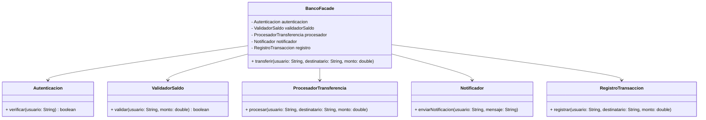

# Patrón Facade

## Definición
El patrón **Facade** proporciona una interfaz unificada y simplificada a un conjunto de interfaces en un subsistema.  
Su objetivo es **ocultar la complejidad** y ofrecer un punto de entrada único para que el cliente interactúe con un sistema más complejo.

---

## Diagrama

## Resultado obtenido
Al ejecutar Main, se espera que se realice la transferencia de fondos entre dos usuarios, mostrando mensajes de depuración que indican cada paso del proceso el cual es orquestado por la clase facade disminuyendo la complejidad para ejecutar varias tareas en un solo metodo.
```
10:40:38.268 [main] DEBUG org.patterns.buscomp.Autenticacion -- Verificando autenticación para: Usuario123
10:40:38.274 [main] DEBUG org.patterns.buscomp.Saldo -- Validando saldo para: Usuario123 por $200.0
10:40:38.275 [main] DEBUG org.patterns.buscomp.Registro -- Transfiriendo $200.0 de Usuario123 a Usuario456
10:40:38.275 [main] DEBUG org.patterns.buscomp.Notificacion -- Enviando notificación a Usuario123: Transferencia exitosa de $200.0
10:40:38.275 [main] DEBUG org.patterns.buscomp.Registro -- Registrando transacción: Usuario123 -> Usuario456 por $200.0
10:40:38.275 [main] INFO org.patterns.BancoFacade -- Transferencia completada.
```
## Donde aplicarlo

| Caso de uso                        | Descripción                                                                               |
| ---------------------------------- | ----------------------------------------------------------------------------------------- |
| Aplicaciones bancarias             | Ocultar la complejidad de autenticación, validación y transacciones en una sola interfaz. |
| Sistemas de e-commerce             | Simplificar operaciones como compra, pago, notificación y envío.                          |
| Supermercados (cajas inteligentes) | Coordinar subsistemas de inventario, cobro, facturación y notificación al cliente.        |
| Fábricas (procesos industriales)   | Unificar varias etapas de producción en un flujo más sencillo para el cliente.            |
| APIs complejas                     | Proveer un único endpoint que abstraiga múltiples servicios internos.                     |

## Ventajas
- Reduce la complejidad al ofrecer una única interfaz simple.
- Desacopla al cliente de los subsistemas internos.
- Mejora la mantenibilidad y la legibilidad del código.
- Permite cambiar subsistemas internos sin afectar al cliente.

## Desventajas 
- Puede convertirse en un punto único de fallo si la fachada falla.
- Puede ocultar demasiada lógica, limitando la flexibilidad del cliente.
- Riesgo de que la fachada se convierta en una “Dios class” si concentra demasiadas responsabilidades.