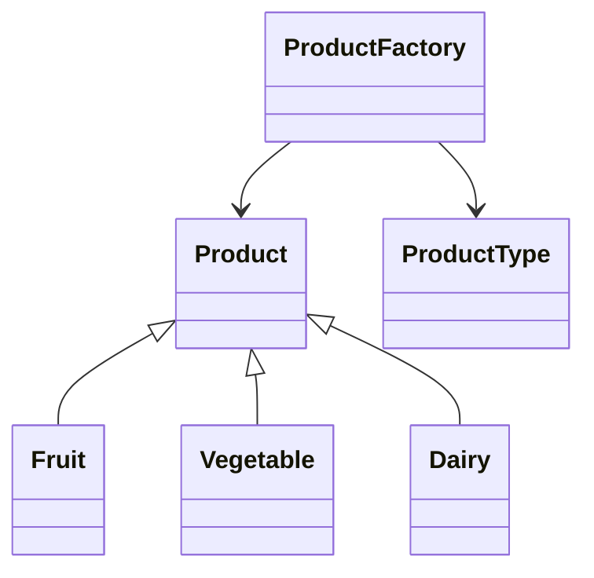

# Patrón Singleton

## Definición
El **Patrón Factory Method** es un patrón de diseño creacional que permite **crear objetos sin exponer la lógica de instanciación al cliente**.  
En su lugar, delega la responsabilidad de creación a una clase llamada *Factory*, lo que hace el código más limpio, flexible y fácil de mantener.

---

## Diagrama

## Resultado obtenido
Al ejecutar Main, se espera que cada tipo de producto se obtenga con la instancia que le corresponde.
```
20:50:36.631 [main] INFO org.patterns.Main -- Instance org.patterns.Fruit - Fruit -> Name: Apple, Price: $0.99
20:50:36.636 [main] INFO org.patterns.Main -- Instance org.patterns.Vegetable - Vegetable -> Name: Carrot, Price: $0.59
20:50:36.637 [main] INFO org.patterns.Main -- Instance org.patterns.Dairy - Dairy -> Name: Milk, Price: $1.49
```
## Donde aplicarlo

Caso de uso                           | Descripción
------------------------------------- | -------------------------------------------------------------------------
**Selección dinámica de productos**   | Cuando el tipo de producto (ej. fruta, verdura, lácteo) se decide en tiempo de ejecución.
**Sistemas de plugins**               | Permite instanciar diferentes implementaciones según la extensión cargada.
**Conexión a bases de datos**         | Crear distintos tipos de conexión (MySQL, PostgreSQL, Oracle) según configuración.
**Procesamiento de archivos**         | Generar lectores diferentes (CSV, XML, JSON) dependiendo del tipo de archivo.
**UI / Componentes gráficos**         | Crear botones, menús o elementos gráficos adaptados a distintos sistemas operativos.
**APIs o servicios externos**         | Instanciar clientes para servicios REST, SOAP o GraphQL de manera desacoplada.

## Ventajas
- Desacopla el código cliente de las clases concretas.
- Facilita la extensión del sistema al agregar nuevos productos.
- Promueve el principio de responsabilidad única.
- Hace más claro y expresivo el proceso de creación de objetos.

## Desventajas 
- Puede aumentar la cantidad de clases en el proyecto.
- La *Factory* puede crecer demasiado si concentra demasiados tipos de creación.
- Hace que la depuración sea más difícil porque el flujo de instanciación está más oculto. 