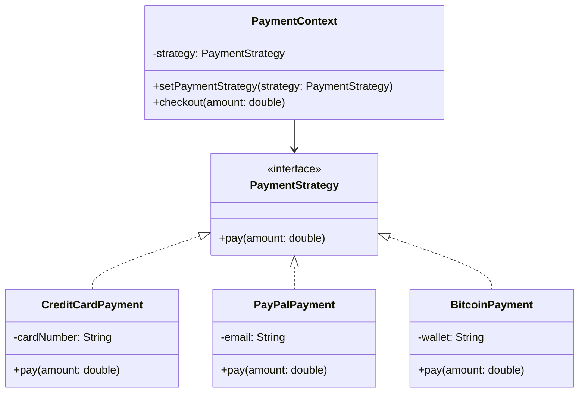

# Patrón Strategy

## Definición
El **Patrón Strategy** permite definir una familia de algoritmos, encapsularlos y hacerlos intercambiables.  
El cliente puede cambiar la estrategia de ejecución en tiempo de ejecución sin modificar el contexto.

## Diagrama

## Resultado obtenido
Al ejecutar el codigo de ejemplo, se observa que el contexto `PaymentContext` puede cambiar dinámicamente entre diferentes estrategias de pago (`CreditCardPayment`, `PayPalPayment`, `BitcoinPayment`) sin modificar su lógica interna.
```
01:35:37.962 [main] INFO org.patterns.CreditCardPayment -- Paid $250.0 using Credit Card: 1234-5678-9876-5432
01:35:37.973 [main] INFO org.patterns.PayPalPayment -- Paid $120.0 using PayPal account: user@example.com
01:35:37.974 [main] INFO org.patterns.BitcoinPayment -- Paid $500.0 using Bitcoin wallet: 1A2b3C4d5E6F
```
## Donde aplicarlo
| **Caso de Uso**                        | **Descripción / Ejemplo**                                                                                                                                                    |
| -------------------------------------- | ---------------------------------------------------------------------------------------------------------------------------------------------------------------------------- |
| Métodos de pago                        | Cambiar dinámicamente entre **tarjeta de crédito, PayPal, criptomonedas** u otros métodos sin alterar la lógica del checkout.                                                |
| Algoritmos de compresión               | Seleccionar entre **ZIP, RAR, 7z** en tiempo de ejecución según la preferencia del usuario.                                                                                  |
| Estrategias de ordenamiento            | Permitir elegir diferentes algoritmos de ordenamiento (**QuickSort, MergeSort, HeapSort**) según el tamaño y naturaleza de los datos.                                        |
| Cálculo de rutas                       | Aplicaciones de mapas que pueden alternar entre **ruta más corta, ruta más rápida, evitar peajes, evitar tráfico**.                                                          |
| Selección de IA / Machine Learning     | Sistemas que pueden alternar entre diferentes modelos (**árboles de decisión, redes neuronales, regresión lineal**) sin modificar la lógica principal.                       |
| Autenticación                          | Soporte para múltiples métodos de autenticación (**usuario/contraseña, OAuth, JWT, biometría**) con la posibilidad de cambiar la estrategia según el entorno.                 |

## Ventajas
- Favorece el principio abierto/cerrado: se pueden agregar nuevas estrategias sin modificar el contexto.
- Permite cambiar el comportamiento en tiempo de ejecución sin alterar el código cliente.
- Separa la lógica del algoritmo de la lógica del contexto, mejorando la modularidad.
- Facilita las pruebas unitarias, ya que cada estrategia se puede probar de forma independiente.
- Las estrategias son reutilizables en distintos contextos.

## Desventajas 
- Aumenta la cantidad de clases en el sistema, ya que cada estrategia requiere su propia implementación.
- El cliente debe conocer las diferentes estrategias disponibles para poder elegir la adecuada.
- Puede introducir complejidad innecesaria si solo se necesita un único algoritmo.
- Existe un pequeño overhead de llamadas adicionales al delegar en la interfaz.
